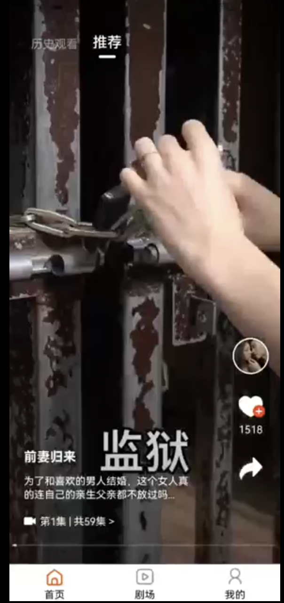

本项目是用react-native开发的短剧App，短剧资源来源于穿山甲短剧SDK。

### 以下任意一项可以联系作者（付费, 微信：zhangzy816）
- 需要专业指导
- 需要定制开发
- 需要ios版本
- 需要升级原生SDK


# 功能演示



[点击观看演示](http://img.smuai.com/demo.mp4 "示例链接")

# 环境要求
- node: 18.0.0+
- jdk: 13+

# 项目说明
## 三方依赖
- 友盟统计与分享SDK
- 微信支付
- 支付宝支付
- 穿山甲广告
- 穿山甲短剧

## 功能清单
1. 穿山甲开屏广告
2. 推荐短剧
3. 历史观看
4. 剧场模块（热门短剧、短剧分类）
5. 短剧播放（看广告解锁）
6. 追剧
7. 我的


# Getting Started
## Step 1: Start the Metro Server

```bash
# using npm
npm start

# OR using Yarn
yarn start
```

## Step 2: Start your Application

### For Android

```bash
# using npm
npm run android

# OR using Yarn
yarn android
```

## Step 3: Modifying your App

1. 修改`app/config`目录下的配置文件
2. 修改 `android/app/src/main/java/{包名}/MainApplication/java` 

```java
//同时需要替换assets目录下的json文件
DPSdk.init(this, "您在穿山甲短剧后台下载的json配置文件", config);
```
